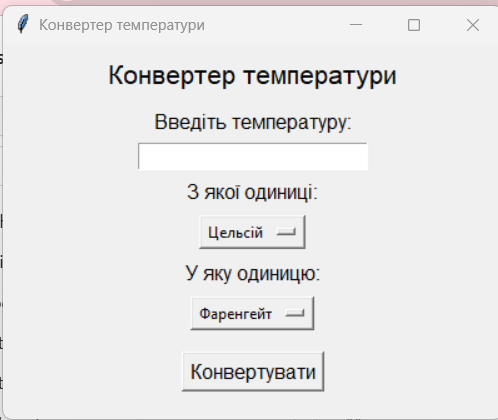
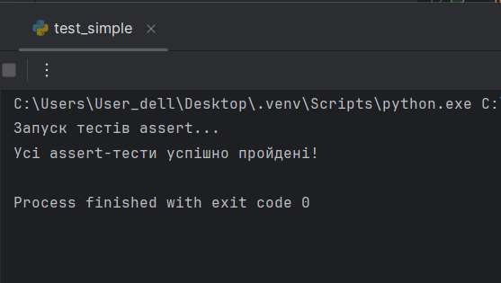
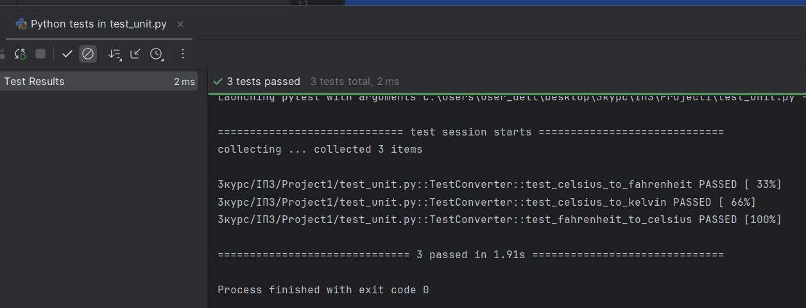
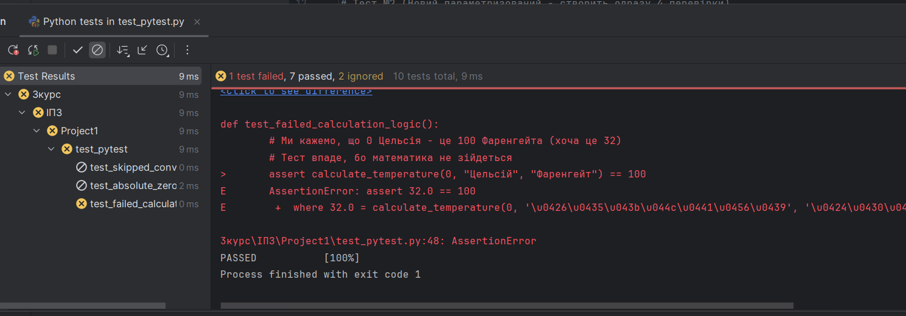

# Програма: "Конвертер температури на Tkinter"
Цей проєкт розроблено в рамках практичної роботи.
Метою є створення графічного застосунку для конвертації температур між різними одиницями вимірювання.

---

## Короткий опис
Конвертер температур дозволяє користувачу переводити температуру між шкалами:
- Цельсій
- Фаренгейт
- Кельвін
Програма створена за допомогою бібліотеки Tkinter та підтримує автоматичне тестування.

---

## Використані технології
- Python 3.10+
- Tkinter
- unittest
- pytest
- 
---

## Скріншот інтерфейсу


---

## Скріншоти тестування
### Assert тести


---

### unittest тести


---

### pytest тести 


---

## Можливості програми 
- 🌡 Конвертація температур
- 🔄 Переведення між різними шкалами
- 🖥 Графічний інтерфейс
- ⚠ Обробка помилок введення
- 🧪 Автоматичне тестування
- 📋 Підтримка unittest та pytest

---

## Структура проєкту
```text 
Program.py — основний застосунок
test_simple.py — assert тести
test_unit.py — unittest тести
test_pytest.py — pytest тести
README.md — опис проєкту
CONTRIBUTING.md — інструкція для користувачів та розробників
```

---

## Запуск програми 
1. Завантажте проєкт
2. Відкрийте папку проєкту
3. Запустіть програму командою:

```bash
python Program.py
```

---

## Запуск тестів 
### Assert тести 
```bash
python test_simple.py
```

### unittest 
```bash
python test_unit.py
```

### pytest 
```bash
pytest -v
```

---

## Документація для розробників
Інструкція для користувачів та розробників:
[CONTRIBUTING.md](CONTRIBUTING.md)

---

## Автор
Студентка: Анастасія Чуйко

---

## Ліцензія

